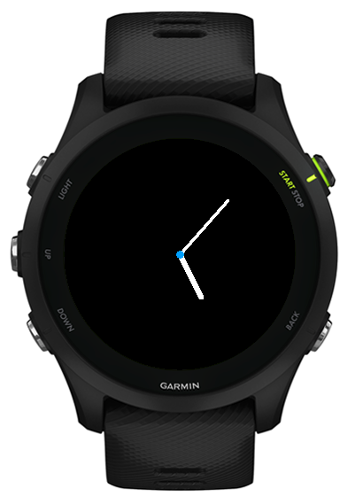
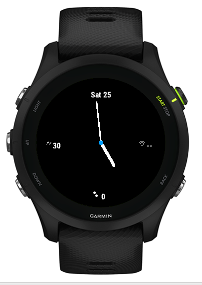

# Analog No Seconds

A minimal Garmin Connect IQ analog watch face for the Forerunner 255. It displays hour and minute hands only, with no seconds hand, dial border, or hour marks.

## Preview

| No data fields enabled | All four data fields enabled |
| --- | --- |
|  |  |

## Configurable fields

Each of the top, right, bottom, and left positions can independently show one of these options:

- None
- Date (`Sat 25`)
- Steps
- Heart rate
- Stress
- Battery
- Calories
- Distance

Selecting **None** leaves that position empty. Fields use accent-colored icons and values; the date is displayed without an icon. Icons are drawn large enough to read at a glance and may sit close to (or overlap) the watch hands.

The default configuration is stress at the top, heart rate on the left, date on the right, and an empty bottom position.

## Colors

Four independent color settings are available, each from an 8-color palette (White, Black, Red, Orange, Yellow, Green, Blue, Gray):

- Hour hand color
- Minute hand color
- Accent color (center dot and all field icons)
- Background color

Field value text automatically switches between white and black to stay legible against whatever background color is chosen.

## Changing settings

Settings can be changed two ways:

- **On the watch**: select this watch face, then choose **Customize** from the Apply/Customize prompt. This opens an on-device menu for all four fields and all four colors.
- **Via phone/computer**: use the Garmin Connect Mobile app or Garmin Express settings page for the app, which exposes the same options through `resources/settings/settings.xml`.

Both paths read and write the same underlying properties, so changes made in one place are reflected in the other.

## Build and run

1. Install Garmin Connect IQ SDK Manager.
2. Install and activate a Connect IQ SDK, then install the `fr255` device definition.
3. Generate a Garmin developer key.
4. Create a local `.env` file containing the developer-key path:

```sh
DEVELOPER_KEY="/path/to/developer_key.der"
```

5. Build the signed watch-face file:

```sh
./scripts/build.sh
```

The output is written to `build/AnalogNoSeconds.prg`. The script resolves the active SDK automatically; set `SDK_PATH` before running it only if you need to override that SDK.

To test the output in the simulator:

```sh
SDK_PATH="/path/to/connectiq-sdk"

open "$SDK_PATH/bin/ConnectIQ.app"
"$SDK_PATH/bin/monkeydo" build/AnalogNoSeconds.prg fr255
```

The developer key must remain private and must not be committed.
